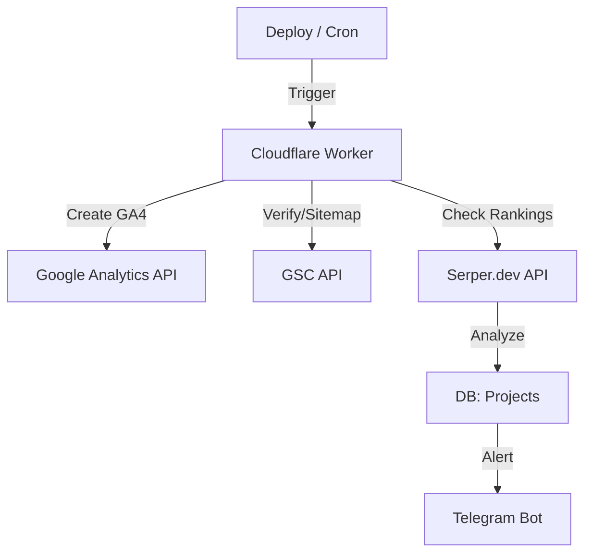

# Phase 7: SEO & Tracking Automation - Research

**Researched:** 2026-04-27
**Domain:** SEO & Tracking Automation (GA4, GSC, Serper.dev, Telegram)
**Confidence:** HIGH

## Summary

Questa fase automatizza la configurazione SEO (GA4, GSC) e il monitoraggio delle performance SERP per i siti Rank Empire Italia. L'architettura sfrutta le API ufficiali di Google e Serper.dev, orchestrate tramite Cloudflare Worker Cron, con alert inviati via Telegram.

**Primary recommendation:** Utilizzare le librerie ufficiali `@googleapis/analyticsdata` e `@googleapis/searchconsole` nel Worker per l'integrazione, e `serper` per il tracciamento SERP.

## Architectural Responsibility Map

| Capability | Primary Tier | Secondary Tier | Rationale |
|------------|-------------|----------------|-----------|
| GA4 Creation | API / Backend | — | Richiede API Keys/Service Accounts e salvataggio stato |
| GSC Sitemap | API / Backend | — | Automazione lato server su evento deploy |
| SERP Monitoring | API / Backend | — | Job pianificato in background |
| Telegram Alerts | API / Backend | — | Logica di business basata su dati SERP |

## Standard Stack

### Core
| Library | Version | Purpose | Why Standard |
|---------|---------|---------|--------------|
| @googleapis/analyticsdata | 5.2.1 | GA4 Admin API | Ufficiale Google |
| @googleapis/searchconsole | 5.2.1 | GSC API | Ufficiale Google |
| serpapi | 2.2.1 | SERP Tracking | Standard del settore per Serper.dev |
| vitest | 4.1.5 | Testing | Già in uso nel progetto |

### Supporting
| Library | Version | Purpose | When to Use |
|---------|---------|---------|-------------|
| google-auth-library | 10.6.2 | Auth | Necessario per le API Google |

**Installation:**
```bash
npm install @googleapis/analyticsdata @googleapis/searchconsole serpapi google-auth-library
```

## Architecture Patterns

### System Architecture Diagram



### Pattern: Job Scheduling
**What:** Utilizzare i Cron Triggers di Cloudflare Workers (es. `0 9 * * 1` per lunedì alle 9).
**When to use:** Monitoraggio settimanale (SEO-03).

### Anti-Patterns to Avoid
- **Hardcoding API Keys:** Utilizzare sempre `wrangler.toml` (secrets).
- **Blocking I/O:** Usare `async/await` per tutte le chiamate API per evitare timeout del worker.

## Don't Hand-Roll

| Problem | Don't Build | Use Instead | Why |
|---------|-------------|-------------|-----|
| SERP Parsing | Custom scraper | Serper.dev | La struttura SERP cambia continuamente |
| Google Auth | Custom OAuth | `google-auth-library` | Gestione token complessa |

## Common Pitfalls

### Pitfall 1: Rate Limiting
**What goes wrong:** API Google/Serper bloccano il worker.
**Prevention:** Implementare backoff esponenziale.
**Warning signs:** 429 Too Many Requests in log.

## Code Examples

### SERP Check Pattern
```typescript
// Source: Serper.dev official docs
import { SerpApi } from 'serpapi';
const client = new SerpApi(process.env.SERPAPI_KEY);
const results = await client.search({ q: 'keyword', location: 'Italy' });
```

## Validation Architecture

### Test Framework
| Property | Value |
|----------|-------|
| Framework | vitest 4.1.5 |
| Config file | `vitest.config.ts` |
| Quick run command | `npx vitest run` |
| Full suite command | `npx vitest run --reporter=verbose` |

### Phase Requirements → Test Map
| Req ID | Behavior | Test Type | Automated Command |
|--------|----------|-----------|-------------------|
| SEO-03 | Serp check logic | unit | `npx vitest run tests/serp.test.ts` |
| SEO-04 | Alert calculation | unit | `npx vitest run tests/alert.test.ts` |

## Security Domain

### Applicable ASVS Categories

| ASVS Category | Applies | Standard Control |
|---------------|---------|-----------------|
| V5 Input Validation | yes | Zod (già in uso) |
| V6 Cryptography | yes | `google-auth-library` (gestione sicura token) |

### Known Threat Patterns
- **Exposure of Service Account Credentials:** Usare secret manager di Cloudflare (non variabili d'ambiente in chiaro).

## Sources

### Primary (HIGH confidence)
- NPM Registry - Version checks (2026-04-27)
- Google Cloud Docs - Search Console API & GA4 Admin API

## Assumptions Log

| # | Claim | Section | Risk if Wrong |
|---|-------|---------|---------------|
| A1 | Serper.dev API sarà sempre accessibile | SERP | Basso |

## Metadata

**Research date:** 2026-04-27
**Valid until:** 2026-05-27
